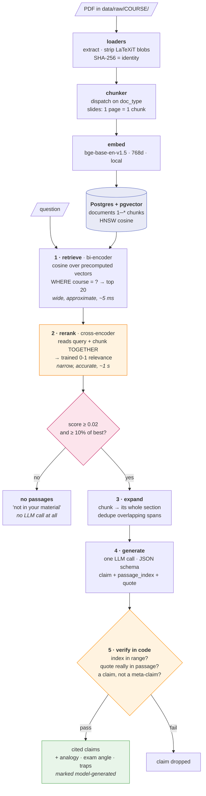

# StudyRAG

A retrieval-augmented study assistant over my own NUS course notes.

Ask about a lecture, get back **claims traceable to a specific slide** — separated from
anything the model invented, with an explicit *"not in your material"* when the corpus
cannot answer.

The point is not a chatbot. It is a RAG system whose failure modes are measured rather
than assumed.

---

## Results

12-question golden set, LLM-drafted and hand-verified, over one lecture deck.
Judge `deepseek-chat`, embeddings `bge-base-en-v1.5` (local).

| Metric | Score | Bar | |
|---|---|---|---|
| faithfulness | **0.963** | 0.80 | Are claims entailed by retrieved context? |
| answer_relevancy | 0.76–0.81 | 0.80 | Does it answer what was asked? |
| context_precision | **0.950** | 0.80 | Is the right context ranked highly? |
| context_recall | **0.950** | 0.80 | Did retrieval find everything needed? |
| abstention_rate | **1.000** | — | Does it admit gaps? *(custom)* |
| abstention_faithfulness | **1.000** | 0.80 | Does it stay grounded when it can't answer? *(custom)* |

**`answer_relevancy` is reported as a range on purpose.** Across runs on barely-changed
code it moved 0.741 / 0.762 / 0.808 / 0.811 — it straddles the bar, and at n=10 with that
variance I cannot distinguish a real regression from judge noise. Continuing to tweak the
prompt until it passed would have been overfitting to the eval. The fix is a larger golden
set, not a better prompt.

The `abstention_*` metrics are mine. **Abstention is refusing to answer when the corpus
cannot support one** — returning no claims and naming the gap instead of producing a
plausible answer from adjacent material. Every ragas metric assumes an answer exists, so a
system that always returns *k* passages and always answers scores identically to one that
knows its limits. Two golden questions are deliberately unanswerable; `abstention_rate` is
how often the gap is named, and `abstention_faithfulness` checks that anything it *does*
say on those questions is still grounded.

**These numbers are optimistic.** One deck, 21 chunks, one topic, no distractor
documents — `context_recall` near 1.0 substantially means "there was only one lecture to
retrieve from". The harness is the deliverable; the numbers get meaningful as the corpus
grows.

---

## The failure it caught

Asked for the convolution output-shape formula — **not in the slides** — the system
answered *"determined by input size, filter size, padding, and stride."* Textbook-correct,
entirely ungrounded, `faithfulness 0.0`. The prompt already forbade outside knowledge.
Asking was not enough.

The fix moved grounding **from a prompt instruction to a code check**: every claim must
quote the span it came from, and that quote is verified against the cited passage before
the claim is allowed out.

Three iterations, and the cost is the interesting part:

1. **Exact quote match** — killed the hallucination, also dropped a *correct* claim whose
   quote had been re-wrapped. Answer came back empty.
2. **75% word overlap** — recovered it, but let meta-claims back in: *"the passage does
   not give the formula"* shares nearly all its words with the passage.
3. **Explicit meta-claim rule** — closes what bag-of-words matching structurally cannot
   see, because word overlap is blind to negation.

A strict verifier trades hallucinations for false rejections. Both directions show up in
the numbers.

---

## Architecture



**Retrieve deterministically → generate once → verify deterministically.** The model is
sandwiched between two layers I control, which is what makes the claims defensible rather
than merely plausible.

---

## Decisions worth defending

**Postgres + pgvector, not Pinecone.** Four of six planned queries are pure metadata
(`DISTINCT ON` for quiz coverage, `GROUP BY` for note density, `id = ANY` for citations),
which a vector index cannot express. It's a metadata database that also does similarity
search, not the reverse. *Pinecone genuinely wins on filtered top-k, scale past ~1M
vectors, and zero index tuning.*

**Small-to-big: embed the slide, return the section.** Slides average ~60 tokens — sharp
vector, thin context. Embedding whole sections would average several ideas into one vector
that matches everything weakly. Expanding at read time costs one extra query.

**The model returns a passage *index*; the code writes the citation.** A model asked to
emit `[lecture05.pdf | p22]` can invent a plausible one that points nowhere. An
out-of-range index is caught by a bounds check.

**Two-stage retrieval, and the reranker earns its place on tokens, not accuracy.** At 21
chunks the quality gain is inside judge noise — I would not claim otherwise. What it
measurably bought: **62% less context at equal recall** (54,812 → 20,987 chars over the
golden set), and a threshold that means something. Cosine needed recalibrating per corpus;
a cross-encoder outputs a trained probability, separating answerable from unanswerable by
0.97 vs 0.008 where cosine gave 0.74 vs 0.45. It costs no API spend — 110M params, local,
~1 s on CPU.

**Two relevance gates, swept against the golden set rather than picked by eye.** An
absolute floor rejects "nothing here matches"; a relative one (10% of the top hit) rejects
"one strong match plus three also-rans". The sweep also found a case *no* threshold can
fix: a question whose answer is a formula rendered as an image, on a slide titled "Exact
formula for the convolution layer". The retriever is right to rank that passage highly —
retrieval relevance and answer presence are different properties, so the threshold handles
one and claim verification handles the other.

**Chunk size is capped by the embedding model, not chosen freely.** MiniLM reads 256
tokens and silently truncates; prose chunks target 400–800. That forced the switch to
`bge-base` (512-token window) *before* ingest, when it cost one `DROP TABLE` instead of a
full re-embed.

---

## Quickstart

```bash
uv sync
cp .env.example .env                          # DATABASE_URL, LLM_*, JUDGE_*
psql "$DATABASE_URL" -f studyrag/db/schema.sql

# drop PDFs into data/raw/<COURSE_CODE>/
uv run python scripts/ingest.py --dry-run     # inspect chunking; no model, no DB
uv run python scripts/ingest.py
uv run python evals/run_eval.py               # writes evals/latest_results.json
```

Ingest is idempotent — files are identified by SHA-256 of their bytes, so an unchanged
file costs one read and one `SELECT`.

**Stack:** Python 3.12 (uv) · Postgres + pgvector (Supabase) · sentence-transformers
(`bge-base-en-v1.5` embedder, `bge-reranker-base` cross-encoder, both local) ·
DeepSeek via an OpenAI-compatible client · ragas. No LangChain or LlamaIndex in the
retrieval path — that logic is the point of the project, and a framework would hide it.

---

## Known gaps

- **One document.** Every number above comes from a single lecture deck.
- **`answer_relevancy` is not a trustworthy gate at n=10.** ±0.05 across runs on
  unchanged code. More golden questions, not more prompt tuning.
- **The claim verifier is blunt.** Word overlap plus a regex is provenance checking, not
  entailment — blind to negation and word order. The reranker is already loaded and is
  the right model to replace it with.
- **Judge and generator are the same model** (`deepseek-chat`), which risks
  self-preference bias. Lower risk for mechanical entailment checks than for subjective
  quality, but unmeasured. The fix is hand-labelling a subset and a second judge from
  another family.
- **Only the `slides` chunking strategy exists.** `prose` and `questions` are stubbed with
  their design written; other types raise rather than silently producing one useless
  5000-token chunk.
- **No `doc_type` filter on retrieval.** Harmless with one document type, a correctness
  bug the moment tutorial questions are ingested.
- **No hybrid search.** Deferred deliberately: `tsv` is a generated column that backfills
  itself, so it can be measured against this baseline rather than added on faith. Recall
  near 1.0 says there's no headroom on *this* golden set — and every question in it is
  conceptual, none is the exact-token lookup (`LeNet-5`, `ReLU`) where lexical search
  wins. So the golden set, not the retriever, is what needs fixing first.
- **Formula images have no text layer**, so retrieval cannot reach the actual equations.
  Faithfulness is not correctness.
- **Judge noise is ±0.02** between identical runs. Small movements aren't signal.

## Roadmap

Expand the golden set (n=30, including lexical questions) so the metrics become
trustworthy → replace the word-overlap verifier with the cross-encoder already loaded →
hybrid (RRF), measured against this baseline → Quiz mode → `questions`/`prose` chunking
for tutorials and textbooks → Exam mode's agent loop → per-course monitor page.
