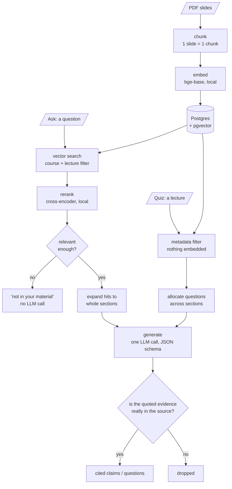

# StudyRAG

A retrieval-augmented study assistant over my own NUS lecture slides. Most of the work
went into measuring it rather than adding features.

**Ask** a question and get an answer built only from your material, every sentence
carrying the slide it came from. Or **quiz** yourself on a lecture, with a cited answer
behind each question. If something isn't in your slides, it says so instead of guessing.


## Results

Ask mode, against a golden set of 29 questions over 3 lectures (171 chunks), written by
an LLM and checked by hand. Scored with ragas, judge model `deepseek-chat`.

| Metric | Score | Bar | |
|---|---|---|---|
| faithfulness | 0.993 | 0.80 | Is every claim supported by what was retrieved? |
| context_recall | 0.820 | 0.80 | Did retrieval find everything the answer needed? |
| context_precision | 0.820 | 0.80 | Is the useful context ranked near the top? |
| answer_relevancy | 0.736 | 0.80 | Does the answer address the question asked? |
| abstention_rate | 1.000 | — | Does it admit when the answer isn't there? |
| abstention_faithfulness | 1.000 | 0.80 | When it can't answer, does it stay grounded? |

Split by question type, which is where it gets interesting:

| type | n | precision | recall |
|---|---|---|---|
| lexical (rare exact tokens) | 6 | 1.000 | 1.000 |
| conceptual | 10 | 0.933 | 1.000 |
| two sections, one lecture | 4 | 1.000 | 0.875 |
| two different lectures | 5 | 0.233 | 0.200 |

The last row is the honest weak spot: questions needing two lectures retrieve one of them.

The two abstention metrics are my own. Every ragas metric assumes an answer exists, so a
system that always answers scores the same as one that knows its limits. Four of the
questions are deliberately unanswerable.

`answer_relevancy` is below the bar, and flat across every question type, which points at
generation rather than retrieval. Answers got longer once I asked for claims that read as
connected prose. That was a tradeoff, not a bug.

## Quiz mode


Quiz retrieves by metadata, not similarity. You pick a lecture, everything in it is in
scope, and the work is deciding what becomes a question. Every section is guaranteed one;
the rest go to the longer sections in proportion.

The golden set doesn't transfer, since three of the four ragas metrics need a user
question or a reference answer and quiz has neither. So it gets three of its own:

| lecture | kept | faithfulness | sections covered | quote validity |
|---|---|---|---|---|
| Lecture 4 | 8/8 | 0.958 | 8 of 14 | 1.000 |
| Lecture 5 | 7/8 | 0.804 | 5 of 6 | 1.000 |
| Lecture 6 | 8/8 | 1.000 | 8 of 9 | 0.889 |

Coverage catches what faithfulness can't: a quiz drawn entirely from one section is a bad
quiz, and faithfulness rates it perfect. Lecture 6 is the interesting row. That deck has
no section headings at all, so the quiz is built from slide ranges instead, which is why
its citations read `slides 49-56`.

## How it works

Both modes share one store and one grounding guarantee. They differ in how they find
material: ask searches by similarity, quiz filters by metadata. Neither writes its own
citation, and every claim is checked in code against the text it cites before you see it.



Four choices worth explaining:

**Postgres + pgvector rather than a vector database.** Most of what this needs are
metadata queries, not similarity search. It's a metadata database that also stores vectors.

**Chunks are single slides, but retrieval returns whole sections.** A slide averages 60
tokens, which makes a sharp vector but thin context. Embedding whole sections would blur
several ideas into one vector.

**Chunks embed with their lecture and section prepended.** A slide body often never names
its own topic: the title says "Backpropagation", the slide says "compute the gradient with
respect to each weight". Prepending `course > lecture > section` put that word back, and
conceptual precision went 0.883 to 0.933.

**The model returns a passage number, not a citation string.** It picks the source and the
code writes the reference, so a made-up citation is impossible.

## What I measured and threw away

- **NLI entailment** to replace my word-overlap claim check. Faithfulness dropped 0.977 to
  0.953 and it discarded 20 correct claims. A correct claim scored 0.016 while the bad
  claim it was meant to reject scored 0.074, so no threshold separates them.
- **Query decomposition** for the cross-lecture problem. Precision improved, recall didn't
  move, and two other slices regressed.
- **Hybrid search**, which I never built. It's usually justified by dense retrieval being
  weak on rare tokens, so I wrote six questions to expose that (`Neocognitron`, `SIFT`,
  `AlexNet`, `1959`). Recall came back 1.000, so there's no gap to close at this size.

The reranker survived, but not for the reason I expected. Accuracy was within noise; what
it did was cut retrieved context by 62% at the same recall.

## Running it

You need your own LLM API key. Any OpenAI-compatible endpoint works: DeepSeek, Gemini, or
a local Ollama. The embedding and reranking models run locally and need no key.

```bash
cp .env.example .env          # fill in LLM_API_KEY
mkdir -p data/raw/CS5242      # put lecture PDFs here

docker compose up --build -d
docker compose run --rm app python scripts/ingest.py
```

Then open http://localhost:8000. The first run downloads about 900 MB of models.

Against your own Postgres instead of the bundled one:

```bash
uv sync
psql "$DATABASE_URL" -f studyrag/db/schema.sql
uv run python scripts/ingest.py
uv run uvicorn studyrag.api:app --reload
uv run python evals/run_eval.py         # ask mode, against the golden set
uv run python evals/run_quiz_eval.py    # quiz mode, one quiz per lecture
```

Re-running ingest skips unchanged files by hashing their bytes. Use `--force` after
changing the chunker or the embedding model, which invalidate stored rows without
changing any file.

**Stack:** Python 3.12, FastAPI, Postgres + pgvector, sentence-transformers
(`bge-base-en-v1.5` and `bge-reranker-base`, both local), DeepSeek, ragas. No LangChain or
LlamaIndex in the retrieval path, since that code is the part I wanted to understand.

## Limits

- Three lectures of one course. Every number here rests on 171 chunks.
- Cross-lecture retrieval doesn't work (recall 0.200). Every fix I tried measured worse.
- Grounded is not the same as correct. One slide says the MLP was introduced by Rosenblatt
  in 1957, which is wrong. The system repeats it faithfully, with a citation, so you can
  catch it.
- Formulas and diagrams are images. Their labels either don't extract at all or extract
  with no reading order, and the system can't tell that from material it simply lacks.
- Only slide decks. Tutorials and textbooks need different chunking and a `doc_type`
  filter on retrieval, neither written yet.
- Judge scores move about ±0.02 between identical runs on the ask eval. Quiz is noisier:
  at 8 questions per lecture, one question shifts the mean by 0.10.

## Next

Chunking for tutorials and textbooks, with the `doc_type` filter that has to come with
them. Then exam question prediction, grounded in tutorial sheets where past papers don't
exist.
