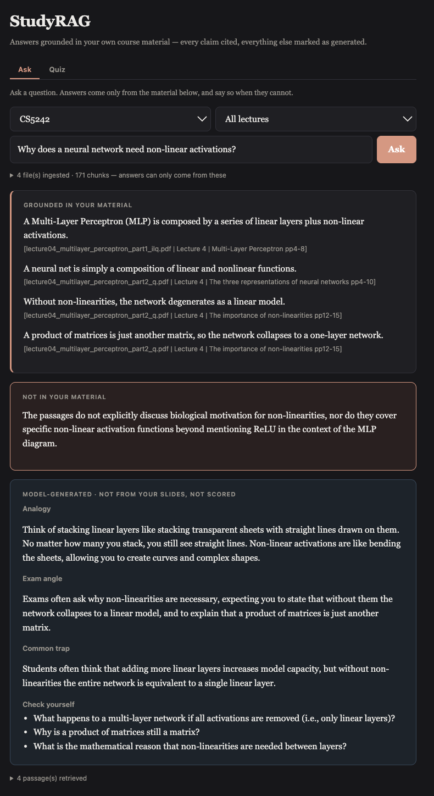
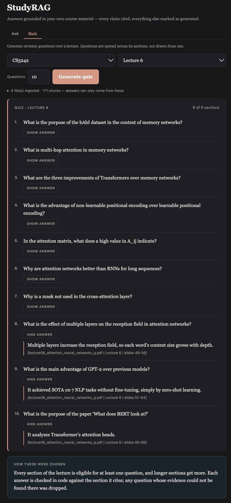
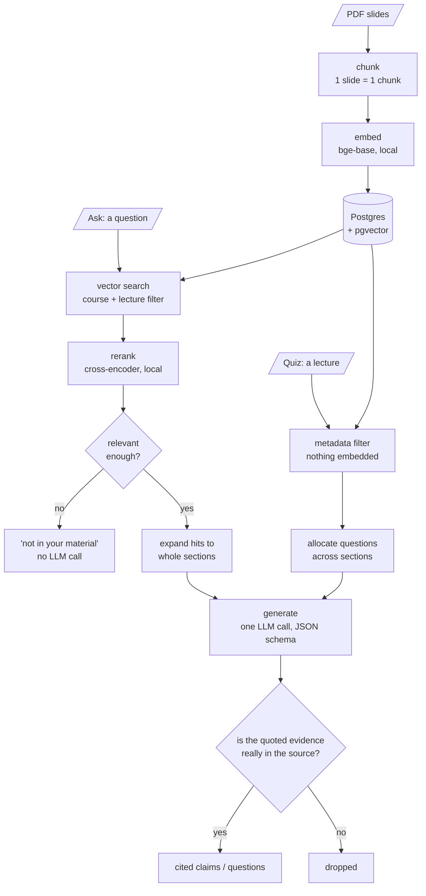

# StudyRAG

A retrieval-augmented study assistant over my own NUS lecture slides, in Python with
FastAPI and Postgres. It has two eval harnesses and 29 golden questions, and the numbers
below are the part I spent longest on.

**Ask** a question and get an answer built only from my slides, every sentence carrying
the one it came from. Or **quiz** myself on a lecture, with a cited answer behind each
question. When something isn't in the slides, it says so instead of guessing.



## Results: ask mode

Scored on six metrics, four from ragas and two of my own. Quiz mode is scored separately,
on three, and shares only one of them.

3 lectures, 171 chunks, 29 golden questions written by an LLM and checked by hand. Every
figure is the mean of three end-to-end runs, committed under `evals/runs/`: same questions,
answers regenerated, judged fresh.

The judge is `deepseek-chat`, and so is the generator. That risks self-preference bias, so
read faithfulness as an upper bound. They are separate settings, so using a different judge
is a `.env` change rather than a code change.

| Metric | Score | Bar | What it asks |
|---|---|---|---|
| faithfulness | 0.952 | 0.80 | Is every claim supported by what was retrieved? |
| context_recall | 0.784 | 0.80 | Did retrieval find everything the answer needed? |
| context_precision | 0.787 | 0.80 | Is the useful context ranked near the top? |
| answer_relevancy | 0.795 | 0.80 | Does the answer address the question asked? |
| abstention_rate | 1.000 | — | Does it admit when the answer isn't there? |
| abstention_faithfulness | 1.000 | 0.80 | When it can't answer, does it stay grounded? |

Three of the six sit under the bar. I'd rather show that than move the bar: at n=25 a
single question is worth 0.04, and the shortfall is concentrated in one question type.

By question type:

| type | n | precision | recall |
|---|---|---|---|
| lexical (rare exact tokens) | 6 | 1.000 | 1.000 |
| conceptual | 10 | 0.933 | 0.983 |
| two sections, one lecture | 4 | 1.000 | 0.667 |
| two different lectures | 5 | 0.067 | 0.222 |

The last row is why. Questions spanning two lectures retrieve one of them, costing 0.18 of
precision. Without that row precision is 0.967 and recall 0.925; I report the inclusive
number, because the lecture selector defaults to searching all of them.

The two abstention metrics are my own. Every ragas metric assumes an answer exists, so a
system that always answers scores the same as one that knows its limits. Only four of the
questions are deliberately unanswerable, so treat 1.000 as "4 for 4", not as a rate.

`answer_relevancy` read 0.736 until I traced it to my own harness. ragas scores it by
reverse-generating questions from the answer and comparing them to the real one, and my
adapter applied BGE's query-instruction prefix to one side only. Identical text scored
0.940 instead of 1.000, so every question paid ~0.06. Fixing it gave 0.795.

## Results: quiz mode



Quiz retrieves by metadata, not similarity. You pick a lecture, everything in it is in
scope, and the work is deciding what becomes a question. Every section is guaranteed one;
the rest go to the longer sections in proportion.

**Quiz is scored on three metrics, only one of which it shares with ask.**
`answer_relevancy`, `context_precision` and `context_recall` all need a user question or a
reference answer, and quiz has neither. `faithfulness` survives the change of task, and
coverage and quote validity are mine:

| lecture | kept | faithfulness | sections covered | quote validity |
|---|---|---|---|---|
| Lecture 4 | 8/8 | 0.951 | 8 of 14 | 1.000 |
| Lecture 5 | 8/8 | 0.827 | 6 of 6 | 1.000 |
| Lecture 6 | 7/8 | 0.976 | 7 of 9 | 0.778 |

Also the mean of three runs. Quiz generation turned out to be fully deterministic at
temperature 0: identical questions kept, identical coverage and quote validity every run.
Only faithfulness moves, so that spread is the judge and nothing else.

Faithfulness rates a quiz drawn entirely from one section as perfect, so coverage is
measured separately. Lecture 6 has no section headings at all, so its quiz is built from
slide ranges, which is why the citations read `slides 49-56`.

## How it works

Both modes share one store and one grounding check. Ask searches by similarity, quiz
filters by metadata. In both, the code writes the citation and verifies the model's quoted
evidence against the source before anything is shown.



Design decisions:

**Postgres + pgvector rather than a vector database.** Course filters, lecture filters
and a join to the documents table are most of what retrieval does here. The vector is one
column of that.

**Chunks are single slides, but retrieval returns whole sections.** A slide averages 60
tokens, which makes a sharp vector but thin context. Embedding whole sections would blur
several ideas into one vector.

**Chunks embed with their lecture and section prepended.** A slide body often never names
its own topic: the deck title says "Backpropagation", the slide says "compute the gradient
with respect to each weight". Prepending `course > lecture > section` put that word back.
Conceptual precision went 0.883 to 0.933, and scored 0.933 in all three runs afterwards,
so the move is larger than the run-to-run spread. Before and after are both in
`evals/runs/`.

**The model returns a passage number, not a citation string.** It picks the source and the
code writes the reference, so a *fabricated* citation cannot exist. Citing the wrong
passage still can: that is caught only by checking the model's quoted evidence against the
passage it named, and that check is word overlap, not entailment.

## What I measured and threw away

- **NLI entailment** to replace my word-overlap claim check. Faithfulness dropped 0.977 to
  0.953 and it discarded 20 correct claims. A correct claim scored 0.016 while the bad
  claim it was meant to reject scored 0.074, so no threshold separates them.
- **Query decomposition** for the cross-lecture problem. Precision improved, recall didn't
  move, and two other slices regressed.
- **Hybrid search**, which I never built. It's usually justified by dense retrieval being
  weak on rare tokens, so I wrote six questions to expose that (`Neocognitron`, `SIFT`,
  `AlexNet`, `1959`). Recall came back 1.000, so there's no gap to close at this size.

The reranker stayed, though not for accuracy, which moved within noise. It earns its place
by producing a score that means the same thing across different questions, which cosine
similarity does not. That is what makes an absolute abstention threshold possible.

## Running it

You need your own LLM API key. Any OpenAI-compatible endpoint works: DeepSeek, Gemini, or
a local Ollama. The embedding and reranking models run locally and need no key.

```bash
cp .env.example .env          # fill in LLM_API_KEY
mkdir -p data/raw/CS5242      # put lecture PDFs here

docker compose up --build -d
docker compose run --rm app python scripts/ingest.py
```

Then open http://localhost:8000. The first run downloads about 900 MB of models.

Against your own Postgres instead of the bundled one:

```bash
uv sync
psql "$DATABASE_URL" -f studyrag/db/schema.sql
uv run python scripts/ingest.py
uv run uvicorn studyrag.api:app --reload
uv run python evals/run_eval.py         # ask mode, against the golden set
uv run python evals/run_quiz_eval.py    # quiz mode, one quiz per lecture
```

Re-running ingest skips unchanged files by hashing their bytes. Use `--force` after
changing the chunker or the embedding model, which invalidate stored rows without
changing any file.

**Stack:** Python 3.12, FastAPI, Postgres + pgvector, sentence-transformers
(`bge-base-en-v1.5` and `bge-reranker-base`, both local), DeepSeek, ragas. No LangChain or
LlamaIndex in the retrieval path, since that code is the part I wanted to understand.

## Limits

- Three lectures of one course. Every number here rests on 171 chunks, and small slices
  swing hard: `multi_section` recall is n=4, so one question is worth 0.125.
- Only slide decks. Tutorials and textbooks need different chunking and a `doc_type`
  filter on retrieval, neither written yet.
- Formulas and diagrams are images. Their labels either don't extract at all or extract
  with no reading order, and the system can't tell that from material it simply lacks.
- One slide says the MLP was introduced by Rosenblatt in 1957, which is wrong. The system
  repeats it faithfully, with a citation. Grounded is not correct, and the citation is
  what makes the difference catchable.

## Next

Chunking for tutorials and textbooks, with the `doc_type` filter that has to come with
them. Then exam question prediction, grounded in tutorial sheets where past papers don't
exist.
